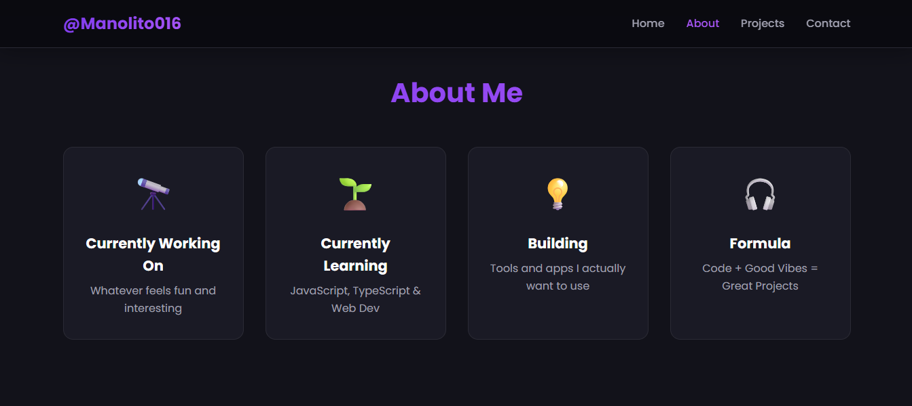
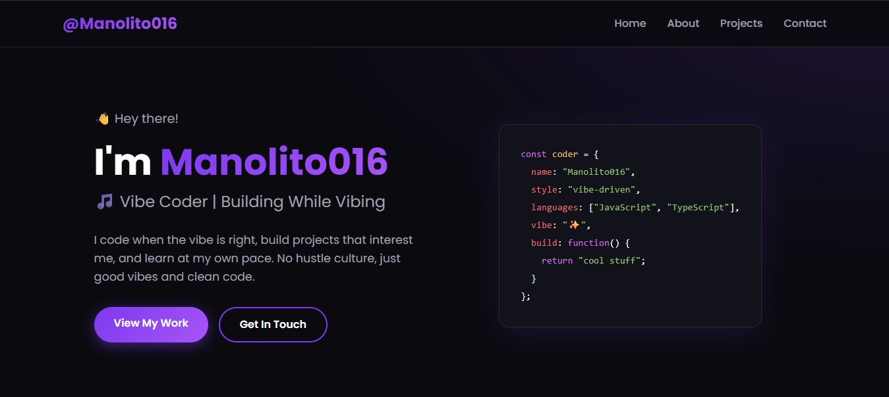

<div align="center">

```
╔══════════════════════════════════════════════════════╗
║                                                      ║
║   [mano lito016]_   ·   portfolio v2.0               ║
║   vibe-driven development                            ║
║                                                      ║
╚══════════════════════════════════════════════════════╝
```

[](.)
[](.)
[](.)
[](.)

[](https://github.com/Manolito016/Portfolio/stargazers)
[](https://github.com/Manolito016/Portfolio/network/members)
[](https://github.com/Manolito016/Portfolio/issues)
[](https://opensource.org/licenses/MIT)

</div>

---

## `$ cat overview.md`

A terminal-aesthetic portfolio built with pure HTML, CSS, and JavaScript — no frameworks, no bloat, just clean code and good vibes. Features a lo-fi dark theme, glitch animations, a typewriter terminal, custom cursor, and scroll-triggered reveals.

---

## `$ ls screenshots/`

<div align="center">



*Desktop View*



*Mobile View*

</div>

---

---

## `$ ls features/`

```
✦  terminal code block    — types itself out on load with syntax highlighting
✦  glitch effect          — hero name splits into RGB offsets on a loop
✦  custom cursor          — dot + trailing ring with smooth lag
✦  role typewriter        — cycles through titles, deletes + retypes
✦  scroll reveal          — cards animate in with staggered delays
✦  scanline + noise       — lo-fi CRT screen overlay
✦  floating window        — terminal gently bobs on a sine curve
✦  active nav highlight   — current section lights up in the navbar
✦  konami code easter egg — ↑↑↓↓←→←→BA triggers hue-rotate vibe mode
✦  fully responsive       — mobile nav with animated hamburger toggle
✦  reduced motion aware   — respects prefers-reduced-motion
```

---

## `$ cat stack.json`

```json
{
  "html": "5",
  "css": "3  →  variables, grid, flexbox, animations, @keyframes",
  "javascript": "ES6+  →  IntersectionObserver, requestAnimationFrame",
  "fonts": ["Space Mono", "DM Sans"],
  "hosting": ["GitHub Pages", "Netlify", "Vercel"],
  "dependencies": 0
}
```

---

## `$ tree Portfolio/`

```
Portfolio/
├── index.html        # markup & structure
├── styles.css        # all styling — variables, layout, animations
├── app.js            # interactions — cursor, typewriters, observers
└── README.md         # you are here
```

---

## `$ git clone && run`

```bash
# clone
git clone https://github.com/Manolito016/Portfolio.git
cd Portfolio

# open directly (simplest)
open index.html

# or spin up a local server
npx http-server .
# → http://localhost:8080
```

---

## `$ deploy --target=?`

**GitHub Pages**
```bash
# push to main, then:
# Settings → Pages → Branch: main → / (root) → Save
# live at: https://manolito016.github.io/Portfolio/
```

**Netlify / Vercel** — connect repo, auto-deploys on every push. Done.

<div align="center">

[](https://vercel.com/new)
[](https://netlify.com)

</div>

---

## `$ vim styles.css  # customize`

All design tokens live in one place:

```css
:root {
    --bg-0:     #080b0f;   /* deepest background      */
    --bg-1:     #0d1117;   /* section backgrounds     */
    --accent:   #39d353;   /* green — swap to taste   */
    --cyan:     #58e6d9;   /* glitch left channel     */
    --red:      #ff6b6b;   /* glitch right channel    */
    --amber:    #f0a832;   /* string highlights       */
    --font-mono: 'Space Mono', monospace;
    --font-sans: 'DM Sans', sans-serif;
}
```

To update content: edit `index.html`. Projects, bio, links — all in plain HTML, clearly commented.

---

## `$ git contribute`

```bash
git fork https://github.com/Manolito016/Portfolio
git checkout -b feature/your-idea
# make changes
git commit -m "feat: your message"
git push origin feature/your-idea
# open a pull request
```

Bug reports → [GitHub Issues](https://github.com/Manolito016/Portfolio/issues). Include browser, OS, and a screenshot if relevant.

---

## `$ cat roadmap.md`

```diff
+ more projects section
+ blog / devlog
+ contact form (Formspree or similar)
+ light mode toggle
+ project screenshots / demos
```

---

## `$ cat license.txt`

MIT — use it, fork it, build on it. Just keep the vibes good.

---

<div align="center">

```
// connect

github   →  github.com/Manolito016
portfolio → manolito016.github.io/Portfolio
email    →  manolitoalmadenjr@gmail.com
```

[](https://github.com/Manolito016)
[](https://www.linkedin.com/in/manolito-almaden-jr-a54a6634a/)
[](https://manolito016.github.io/Portfolio/)
[](mailto:manolitoalmadenjr@gmail.com)

---

*good vibes, good code.*  
**built by Manolito016 ✨**


</div>